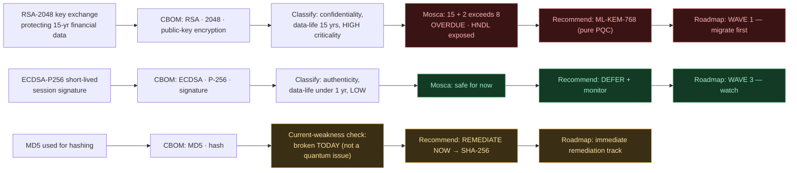

# Blindspot ECDAT — How It Works

> **The problem:** you cannot migrate cryptography you cannot find.
> **What Blindspot does:** point it at a codebase, and it discovers every
> cryptographic asset, decides which ones quantum computers put at risk *and by
> when*, and hands back a prioritized migration plan — not just a list.

---

## 1. The pipeline (read left → right)

Every scan runs the same six stages. Each box says what happens in plain terms.

```mermaid
flowchart LR
    IN["INPUT<br/>a code repo (GitHub URL),<br/>container image, or<br/>live TLS endpoint"]:::io

    IN --> S1["1 · SCAN<br/>find crypto in source code,<br/>dependencies, binaries, config,<br/>certificates, HSM / cloud KMS"]:::stage
    S1 --> S2["2 · INVENTORY<br/>build a standardized<br/>CycloneDX CBOM —<br/>one entry per crypto asset"]:::stage
    S2 --> S3["3 · CLASSIFY<br/>tag each asset: type,<br/>how long its data must stay secret,<br/>business criticality"]:::stage
    S3 --> S4["4 · ASSESS RISK<br/>Mosca's inequality:<br/>data-life + migration-time vs<br/>quantum arrival = risk tier"]:::stage
    S4 --> S5["5 · RECOMMEND<br/>PQC / Hybrid / Defer,<br/>a named replacement algorithm,<br/>with cost and latency"]:::stage
    S5 --> S6["6 · PLAN<br/>prioritized migration roadmap:<br/>fix these first, then these,<br/>in sequenced waves"]:::stage

    S6 --> OUT["OUTPUT<br/>Dashboard · CBOM inventory ·<br/>Migration roadmap · Compliance view ·<br/>Report (PDF / CSV)"]:::io

    classDef stage fill:#11171E,stroke:#7DB7E8,color:#DBEAFE;
    classDef io fill:#0C1117,stroke:#4FB37A,color:#A7F0C6;
```

---

## 2. Follow real findings through it

The same pipeline treats three findings very differently — this is the point:
it does **not** mark everything urgent, and it separates "broken today" from
"quantum risk later."

- **Overdue (red)** — long-lived secret, quantum-breakable → migrate first (PQC).
- **Low-risk (green)** — short-lived → defer, don't waste effort.
- **Weak today (amber)** — a present-day defect (MD5), fixed on a *separate* track regardless of quantum timelines.

---

## 3. What makes it more than a scanner (the differentiators)

Most tools stop at stage 2 (a list). Blindspot continues:

- **Migration Roadmap** — sequenced, prioritized waves with effort/cost.
- **Compliance Sensitivity** — re-run the risk under real regulatory deadlines
  (India CII 2027-29, NIST 2030/2035) and watch how many assets become overdue.
- **HNDL flag** — calls out "harvest-now-decrypt-later" exposure explicitly.
- **Honest confidence** — flags what it is *not* sure about instead of guessing.
- **Live cloud KMS attestation** — AWS KMS, Azure Key Vault, GCP KMS. Reads
  algorithm + key size + **rotation configuration** straight from the vendor
  API. Not a declaration; the vault itself answers.
- **HSM / PKCS#11 attestation** — opens a real PKCS#11 session, enumerates
  keys, reads their attributes. HSM-backed keys (Azure, PKCS#11) stay tagged
  as hardware modules through the pipeline.
- **Live TLS bundled into the same scan** — one scan can carry both a repo
  and a list of TLS endpoints. Certificates flow through the same classifier
  + risk engine as source findings.
- **On-prem / air-gap-ready** — set `STORAGE_BACKEND=local` and no Firebase
  call ever happens; every scan lives on the local disk and survives restart.
  The UI displays the current storage backend as a top-bar chip so the state
  is auditable in one glance.
- **Cross-scan history + trend** — every scan is mirrored to `artifacts/`, and
  the Dashboard renders a per-Risk_Tier trend line across the project's scan
  history. Restart-survivable, no database.

---

## 4. Under the hood (one line, for the technical judge)

FastAPI backend runs the six stages synchronously in one process; discovery uses
Semgrep + purpose-built scanners across 5 languages, binaries, certs, config,
HSM (PKCS#11), and cloud KMS (AWS / Azure / GCP live-attested via each vendor's
SDK); the CBOM is schema-valid CycloneDX 1.6; results are mirrored to the local
filesystem (**no external database, air-gap-safe**), with optional Firebase
persistence when configured; served to a React GUI.

---

## 5. Maps to the problem statement (PS 26164)

| PS asks for | Stage that delivers it |
|---|---|
| Discover all crypto artefacts (algos, keys, certs, protocols, libraries, HSM, cloud) | 1 · SCAN |
| Standardized inventory / report | 2 · INVENTORY (CycloneDX CBOM) + Report |
| Classify by type, lifetime, criticality | 3 · CLASSIFY |
| Quantum risk via Mosca's framework | 4 · ASSESS RISK |
| Recommend PQC / Hybrid alternatives | 5 · RECOMMEND |
| Preparedness / operational investment | 6 · PLAN (roadmap) |
| Interactive GUI | OUTPUT (dashboard + views) |
